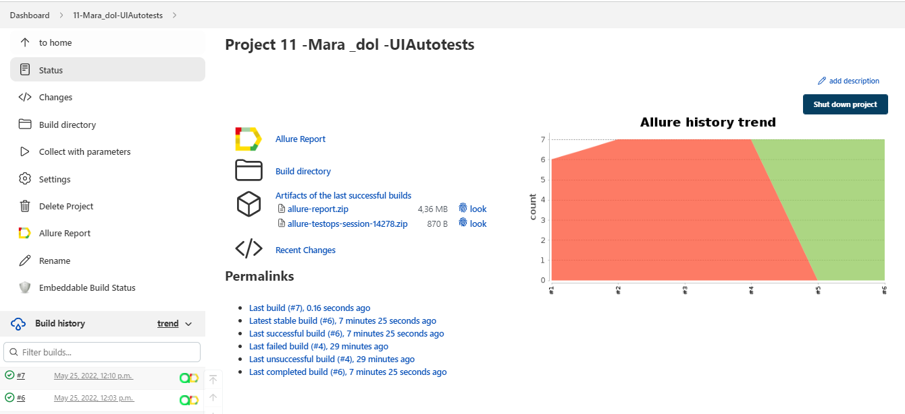
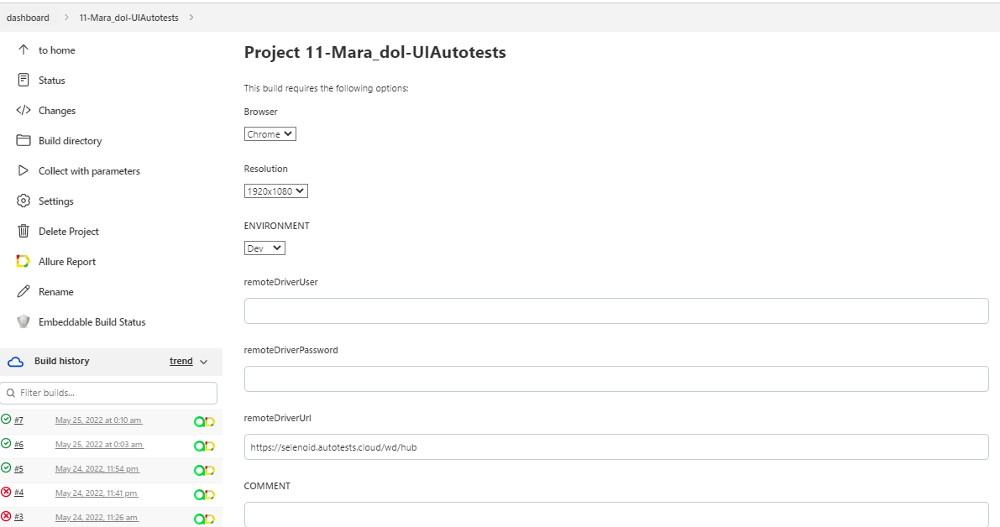
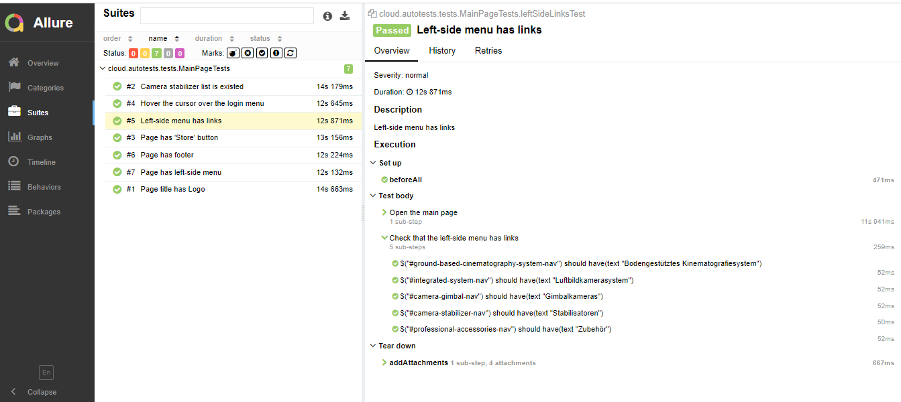
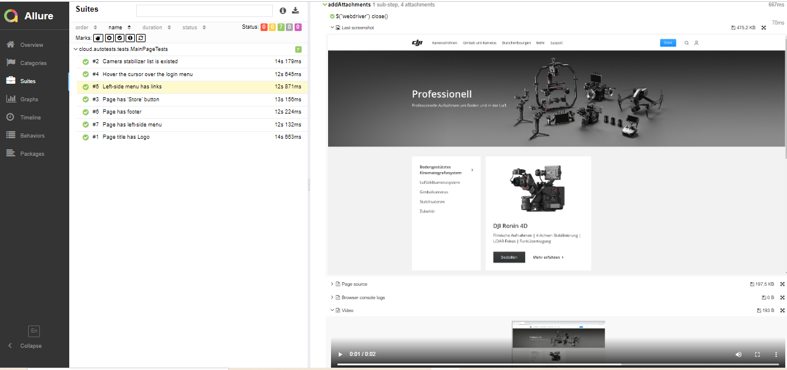
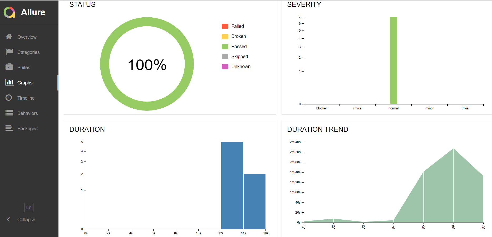
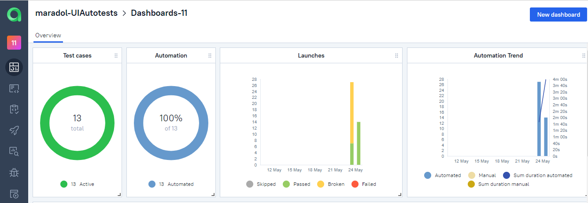
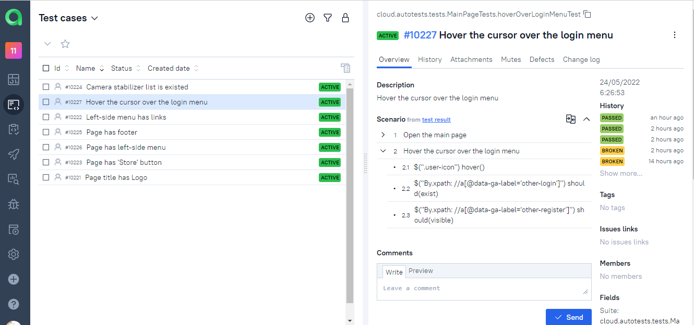
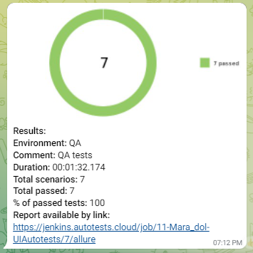

#  UI Automation Framework for 'DJI' website

Click [here](https://www.dji.com/de/products/professional) to take a look at the website!

## Technologies used in the project:

[](https://www.java.com/)
[](https://www.jetbrains.com/idea/)
[](https://github.com/)
[](https://junit.org/junit5/)
[](https://gradle.org/)
[](https://rest-assured.io/)
[](https://aerokube.com/selenoid/)
[](https://github.com/allure-framework/allure2)
[](https://www.jenkins.io/)
[](https://qameta.io/)


## What is special about this project:

✓ PageObjects

✓ Parameterized build

✓ Owner.config

✓ Telegram notifications


## To run tests locally use:

```
gradle clean test
```


## Test cases

✓ Page title has Logo

✓ Page has 'Store' button

✓ Page has left-side menu

✓ Page has footer

✓ Left-side menu has links

✓ Camera stabilizer list is existed

✓ Hover the cursor over the login menu


## Jenkins Job

Jenkins is an automation server which lets us run tests

Click <a target="_blank" href="https://jenkins.autotests.cloud/job/11-Mara_dol-UIAutotests/">here</a> to see the job for "Dji" website

<p align="center">

</p>

It is the job that can run with different parameters as browser, resolution of screen and environment.

<p align="center">

</p>

## Allure report

Allure Report is a flexible, lightweight test reporting tool. It provides clear graphical reports and allows extracting
the maximum of information from the everyday testing process.

Click <a target="_blank" href="https://jenkins.autotests.cloud/job/11-Mara_dol-UIAutotests/7/allure/">here</a> to see the report for "Dji" website


### Test suites

<p align="center">

</p>

### Attachments

A screenshot and video are attached for each test.

<p align="center">

</p>

### Graphs

<p align="center">

</p>


## Allure TestOps

Allure TestOps allows you to manage testing in one place.
Supports the full testing lifecycle for both manual and automated tests.

Click <a target="_blank" href="https://allure.autotests.cloud/project/1348/launches">here</a> to see the lanches for "Dji" website

### Dashboard

<p align="center">

</p>

### Test Cases

<p align="center">

</p>


## Telegram Notification

After the tests are completed, the report comes to Telegram using a bot

<p align="center">

</p>